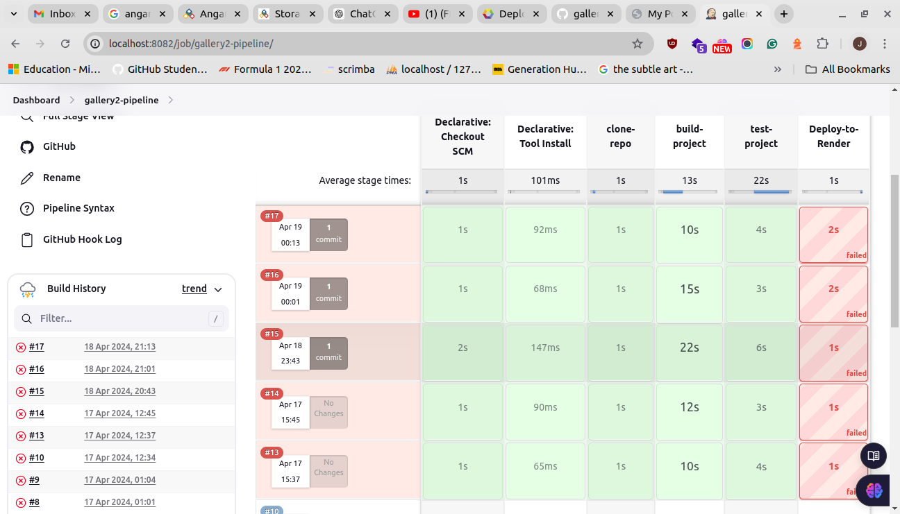
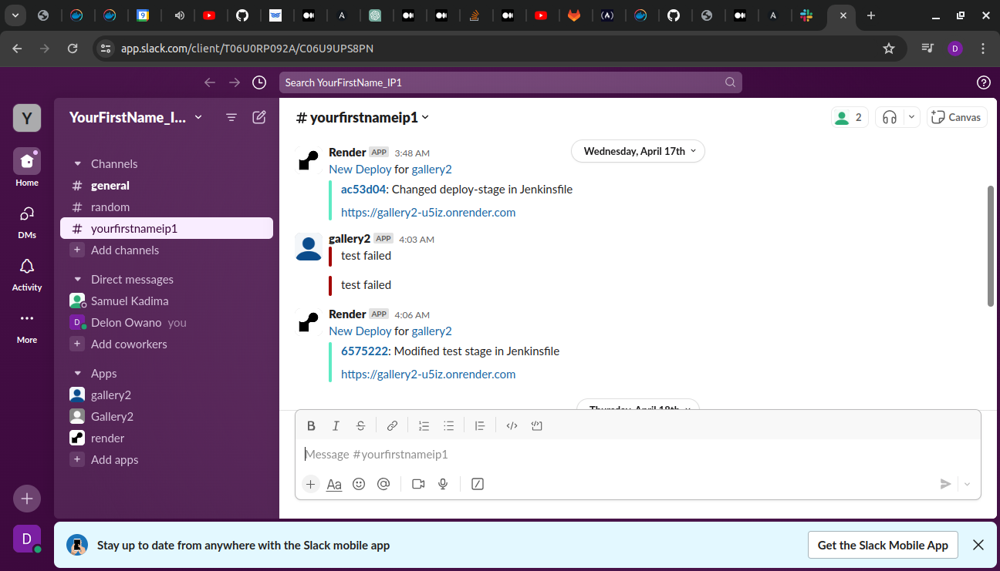

# DevOps Pipeline Documentation
## Overview 

 I developed a comprehensive DevOps pipeline using a Jenkins container to streamline our application's workflow. This pipeline automates several critical stages of the software development lifecycle, ensuring efficient, reliable, and consistent application delivery.

 ## Key Features
 ### 1. Dependency installation
- Automates the installation of all required dependencies for the application.
- Ensures all environments have consistent and up-to-date dependencies.

### 2. Automated Testing 
- Executes a suite of automated tests to verify the application's integrity.
- Identifies issues early in the development process, improving code quality.

### 3. Deployment to Render
- Automates the deployment process to the Render platform.
- Ensures consistent deployment practices and reduces manual intervention.

### 4.Notifications
- Sends notifications regarding deployment status and test results.
- Alerts the team to any failures, allowing for quick resolution.

## Benefits 
- Efficiency: Automates repetitive tasks, freeing up developer time for more complex issues.
- Reliability: Consistent environment setup and deployment processes reduce errors.
- Quick Feedback: Immediate notifications and test results help in rapid issue resolution.
- Consistency: Standardized processes ensure all deployments follow the same procedure, reducing variability and potential issues.

## Screenshot of Jenkins pipeline 

## Screenshot of slack notification recieved 

## Conclusion 

This DevOps pipeline significantly enhances the development and deployment process, making it more efficient, reliable and consistent. By automating dependency installation, testing, deployment and notifications, it supports continuous integration & continuous delivery practices ultimately leading to a more robust and maintainable application.

